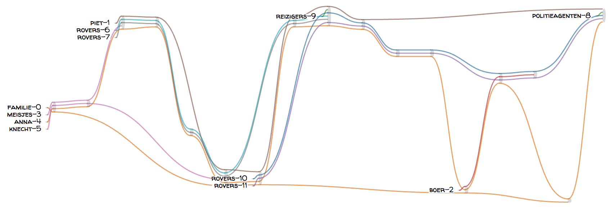

# Fairy Tales Coreference Corpus

This repository provides a small corpus (`texts/`) of Dutch fairy tales from the collection *Volkssprookjes uit Nederland en Vlaanderen* by Sinninghe (1978). The corpus has been annotated for coreference, which  comprises mainly character coreference (including both proper names and nouns referring to characters). The annotations have been made using [brat](http://brat.nlplab.org/) and can be found under `annotations/`. The folder `visualization/` provides a playful narrative chart visualization of each story, such as the following:

To view all visualizations, move to the visualization directory and run a local server, e.g. using:

    python -m http.server

